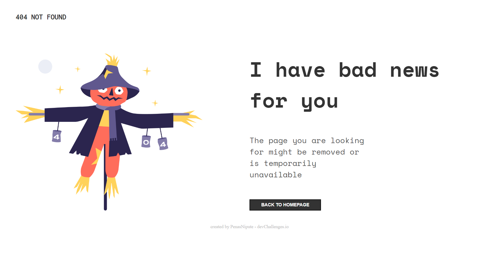

<!-- Please update value in the {}  -->

<h1 align="center">404 NOT FOUND</h1>

   Solution for a challenge from  <a href="http://devchallenges.io" target="_blank">Devchallenges.io</a>.

  <h3>
    <a href="https://penasnipute.github.io/404_Not_Found/">
      Demo
    </a>
     | 
    <a href="https://github.com/penasNipute/404_Not_Found">
      Solution
    </a>
     | 
    <a href="https://devchallenges.io/challenges/wBunSb7FPrIepJZAg0sY">
      Challenge
    </a>
  </h3>

<!-- TABLE OF CONTENTS -->

## Table of Contents

- [Overview](#overview)
  - [Built With](#built-with)
- [Features](#features)
- [Contact](#contact)
- [Acknowledgements](#acknowledgements)

<!-- OVERVIEW -->

## Overview

![screenshot]

Whatsapp guys, this is my firs challenge solved here on DevChallenges.

You guys can see the preview of my solution in <a href="https://penasnipute.github.io/404_Not_Found/">
preview
</a>

T have expirience in a few other js frameworks like nodeJs an reactJs but in this case i did the simple, i used html and css only.

This challenge was to certify to my self that i was capable to do this by my on, just whit a figma design.

- Your wisdom? :)

### Built With

HTML and CSS

## Features

<!-- List the features of your application or follow the template. Don't share the figma file here :) -->

This application/site was created as a submission to a [DevChallenges](https://devchallenges.io/challenges) challenge. The [challenge](https://devchallenges.io/challenges/wBunSb7FPrIepJZAg0sY) was to build an application to complete the given user stories.

## Acknowledgements

<!-- This section should list any articles or add-ons/plugins that helps you to complete the project. This is optional but it will help you in the future. For exmpale -->

- [Steps to replicate a design with only HTML and CSS](https://devchallenges-blogs.web.app/how-to-replicate-design/)
- [Node.js](https://nodejs.org/)
- [Marked - a markdown parser](https://github.com/chjj/marked)

## Contact

- Website [your-website.com](https://{your-web-site-link})
- GitHub [@PenasNipute](https://github.com/penasNipute)
- Twitter [@penasNipute](https://twitter.com/penasNipute)
